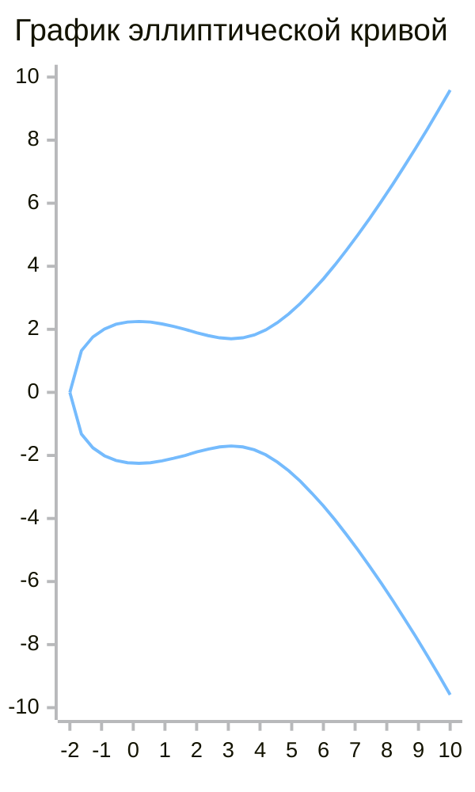

> {слайд 1 - заставка}

> {слайд 2 - дисклеймер}

# Введение

> {слайд 3 - математика?}

На tech talk "Криптография для самых маленьких" Влад, в разделе про шифрование на `эллиптических кривых`, навел тумана на этот раздел криптографии, показав кучу формул и графиков как бы намекая, что это какая-то магия и без 100 грамм не разберешься. Действительно, в рамках обзорного доклада о криптографии, затруднительно рассказать что-то вразумительное на эту тему. Поэтому я решил восполнить данный пробел и развеять туман неизвестности над способами шифрования с использованием `эллиптических кривых`.

Начнем со скучного, с теории и математики. Думаю все в школе сталкивались с вопросом: "зачем это учить, если в жизни оно не пригодится". Сейчас будет что-то похожее с тем отличием, что мы все выросли и понимание пришло. Конечно чтобы досконально разобраться с математикой в этом разделе криптографии одного tech talk не хватит, но я уверен, что если вы помните со школы основные арифметические действия вроде сложения и умножения, то составить представление о принципах ассиметричного шифрования на `эллиптических кривых` вам вполне по силам.


## Конечные поля

> {слайд 4 - конечные поля}

Приступим.

Разговор о принципах шифрования невозможно представить без рассказа о такой штуке как поля, точнее `конечные поля`. Почему важно понять что такое `конечные поля`. Потому что это такая вещь, которая лежит в основе без преувеличения всего:
- криптография: ECC, AES, хеширование;
- телекоммуникации: алгоритмы помехоустойчивого кодирования, быстрые алгоритмы свертки и фильтрации, FFT;
- IT: ГПСЧ, алгоритмы хеширования, блокчейн, распределенные СУБД, алгоритмы сжатия.

## Историческая справка

### Алгебраические уравнения

> {слайд 5 - алгебраические уравнения}

Небольшая историческая справка. `Конечные поля` еще называются полями Галуа. Эварист Галуа - это математик живший в XIX веке. Основная область его научных интересов - это решение алгебраических уравнений.

```math
ax^n+bx^{n-1}+...+px^2+qx+r = 0
```

Вообще интересно проследить как человечество постепенно приходило к более сложным уравнениям и методам их решения:
* Древний мир (до V века н.э.):
  - вавилоняне (около 2000г. до н.э.) и египтяне (около 1650г. до н.э.) научились решать линейные уравнения;
  - вавилоняне и греки (около 300г. до н.э.) научились решать квадратные уравнения;
* Средневековье и исламский мир (V–XV века):
  - аль-Хорезми (IX век) тот из-за кого алгебра называется алгеброй, систематизировали методы решения линейных и квадратных уравнений;
  - Омар Хайям (XI век) использовали геометрические методы для приближённого решения кубических уравнений;
* Эпоха Возрождения (XVI век)
  - в XVI веке итальянские математики Сципион дель Ферро, Никколо Тарталья и Джероламо Кардано разработали общие формулы для решения кубических уравнений;
  - ученик Кардано, Лодовико Феррари, нашёл метод решения уравнений четвёртой степени, сводя их к кубическим; 
* Новое время (XVII–XIX века)
  - математики, такие как Жозеф Луи Лагранж и Паоло Руффини, пытались найти общие формулы для уравнений пятой степени, но безуспешно. Руффини выдвинул гипотезу, что такие формулы могут не существовать.
  - Эварист Галуа (1811–1832) разработал теорию, которая объяснила, почему уравнения степени 5 и выше не могут быть решены в радикала (с помощью арифметических операций и извлечения корней). Он ввёл понятие группы Галуа, которая описывает симметрии корней уравнения. Его работа стала основой современной алгебры.
* Современная эпоха (XX–XXI века)
  - с развитием вычислительной техники стали широко использоваться численные методы для приближённого решения уравнений высших степеней.

Таким образом это важная задача, которая волновала человечество на протяжении столетий и наш герой произвел революцию в деле нахождения корней алгебраических уравнений.

### Эварист Галуа 
> {слайд 6 - Эварист Галуа, на слайде картинка Галуа, еще можно мем с Drake, где Маск|Tony Stark и Галуа}

**Эварист Галуа** — выдающийся французский математик, чьи работы заложили основы современной алгебры. Его жизнь была короткой, но яркой, а его вклад в науку оказался революционным.

Эварист Галуа родился 25 октября 1811 года в пригороде Парижа, в семье образованных людей. ~~Галуа учился в лицее, где проявил необычайный талант к математике. Однако его вредный характер и увлечение политикой часто приводили к конфликтам с преподавателями~~

Галуа интересовался алгеброй, особенно решением алгебраических уравнений. В возрасте 17 лет он сделал открытие, которое позже стало основой теории Галуа. Эта теория изучает симметрии корней уравнений и позволяет определить можно ли решить уравнение с помощью арифметических операций и извлечения корней.

Галуа ввёл понятия групп и полей, которые стали одним из ключевых в современной математике. Его работы (а после него осталось всего лишь 60 небольших листов) были настолько опережающими своё время, что современники не смогли их оценить. Лишь спустя десятилетия, благодаря усилиям таких математиков, как Огюстен Луи Коши и Жозеф Лиувилль, теория Галуа была понята и признана.

Галуа был страстным республиканцем и активно участвовал в политической жизни Франции. Он боролся против монархии и поддерживал революционные идеи. Его политическая активность привела к нескольким арестам. В тюрьме он продолжал заниматься математикой, но его жизнь оборвалась трагически. В 20 лет Галуа погиб на дуэли.

Его жизнь стала символом трагической судьбы гения, опередившего своё время.

# Основная часть

## Конечные поля

### Что это вообще такое?

> {слайды 7, 8, 9 - свойства полей и арифметика по модулю}

> {слайд 7 - поля}

Перейдем к сущности понятия `конечные поля`. Если совсем по-простому, то поле - это просто ограниченный набор чисел, например: {0, 1, 2, 3, 4}. Но есть нюанс. Когда мы производим математические операции над элементами поля, результат должен остаться внутри поля. Но если мы сложим элементы поля $P_{5}$ 3 и 4 то получим число 7, а оно не лежит в $P_{5}$. Непорядок. 

> {слайд 8 - операции, ИНТЕРАКТИВ}

Получается нужно переопределить операции над элементами так, чтобы результат оставался в поле. Эти все операции определяются на основе арифметики по модулю. Итого получается 3 + 4 = 2. 

> {слайд 9 - требования к операциям}

Вообще для определения конечного поля, нужно чтобы кроме элементов поля были определены операции сложения и умножения, которые удовлетворяют следующим условиям:
- нулевой элемент множества - это элемент который удовлетворяет условию: \(A + Z = A \);
- единичный элемент множества - это элемент, который удовлетворяет условию: \(A x I = A \);
- отрицательный элемент - это элемент, который удовлетворяет условию: \(A + (-A) = 0 \);
- обратный элемент множества - это элемент, который удовлетворяет условию: \(A x A^{-1} = A \).
В общем случае элементами поля может быть что угодно, например полиномы, матрицы и что угодно еще, главное чтобы были определены операции сложения и умножения над этими элементами.

### Зачем оно нужно?

> {слайд 10 - зачем нужны вычисления в полях}

Подведем промежуточный итог. Я много говорил о важности `конечных полей`, о том, что они как-то связаны с алгебраическими уравнениями, и, как будто, от этого легче не стало и туман только сгущается. Важно понять, что `конечные поля` - это всего лишь один из инструментов, который Галуа использовал в своей теории, они существуют сами по себе и их можно изучать так же как геометрию. `Конечные поля` представляют собой специальные алгебраические структуры, которые обладают рядом свойств, делающих их идеальными для криптографических приложений. И прежде чем перейти к рассказу о самих полях, поясню какое место они занимают вообще в криптографии на `эллиптических кривых` и чем они заслужили рассказ о себе. Когда мы говорим о криптографии на `эллиптических кривых` первую очередь имеем в виду шифрование данных. Шифрование — это процесс преобразования информации в форму, недоступную для прочтения без специального ключа, чтобы защитить её от несанкционированного доступа. В общем случае информация представлена в виде чисел (битовых последовательностей), то есть шифрование - это последовательность каких-то математических преобразований над числами. А что это за числа? Это могут быть все действительные числа, целые числа, простые числа, комплексные числа и еще куча других. Но оказывается, что если математические операции производить не просто над произвольными числами, а над полями, то мы получаем ряд существенных преимуществ, без которых скорее всего ничего бы не вышло.

1. Конечность и управляемость
Одним из главных преимуществ полей Галуа является их конечность. Поле Галуа — это конечное множество элементов, в отличие от бесконечного множества целых чисел. Конечность поля Галуа позволяет работать с ограниченным набором значений, что обеспечивает предсказуемость и стабильность результатов. Например, в AES используется поле, которое содержит 256 элементов. Это позволяет эффективно выполнять операции шифрования и дешифрования, так как все вычисления происходят в рамках ограниченного набора значений. Если бы мы использовали все целые числа, то столкнулись бы с проблемами переполнения, округления и необходимости работы с бесконечно большими числами, что значительно усложнило бы реализацию алгоритмов.

2. Арифметика по модулю и обратимость
В полях Галуа все операции выполняются по модулю некоторого простого числа. Это обеспечивает замкнутость операций: результат любой операции (сложения, вычитания, умножения) всегда остается в пределах поля. Более того, в полях Галуа каждый ненулевой элемент имеет мультипликативный обратный, что позволяет выполнять деление. Если бы мы использовали все целые числа, то обратимость была бы невозможна, так как не для всех целых чисел существует обратный элемент в рамках целочисленной арифметики. Это сделало бы многие криптографические алгоритмы неработоспособными.

3. Защита от атак перебором
Конечность полей Галуа также играет важную роль в защите от атак перебором. В криптографии размер поля Галуа определяет сложность взлома алгоритма. Например, в AES используется поле из 256 элементов, что обеспечивает 256 возможных значений для каждого байта данных. Это делает перебор всех возможных ключей вычислительно неосуществимым при достаточно большом размере ключа.
Если бы мы использовали все целые числа, то злоумышленник мог бы теоретически подобрать ключ, перебирая все возможные значения, что сделало бы криптографическую систему уязвимой. Конечность полей Галуа ограничивает пространство ключей, но делает его достаточно большим для обеспечения безопасности.

4. Эффективность вычислений
Поля Галуа позволяют эффективно выполнять криптографические операции, такие как умножение, возведение в степень и вычисление обратных элементов.


## Эллиптические кривые

### Что это вообще такое?

> {слайд 11 - график `эллиптической кривой`}

Наконец-то добрались до чего-то, связанного с темой доклада. Если у вас, как у меня `эллиптические кривые` ассоциируются с эллипсами, из курса школьной геометрии, то с этим мифом нужно попрощаться. 

Дело в том, что обобщенное уравнение эллипса имеет вид:
```math
x^2/a^2+y^2/b^2 = 1;
```
то есть это уравнение второй степени. А уравнение эллиптической кривой задается уравнением третьей степени:
```math
y^2=x^3+ax+b;
```
Вообще эллипс и `эллиптическая кривая` не имеют вообще ничего общего и у них есть принципиально различающиеся свойства. Эллипс - замкнутая ограничен кривая, `эллиптическая кривая` наоборот - неограниченная кривая, которая может уходить на бесконечность и даже может быть расчлененной.


### Арифметика точек, лежащих на эллиптической кривой

> {слайды 12, 13, 14 - иллюстрация операции сложения, пояснения про свойства операции сложения}

> {слайды 12 - иллюстрация операции сложения, пояснения про свойства операции сложения}

И так, мы узнали, что такое `эллиптические кривые`, но как они используются в криптографии? Едем дальше. Кому-то, назовем этот собирательный образ ***чокнутый ученый***, пришла в голову мысль: _"А почему бы не изобрести операцию сложения на множестве точек `эллиптических кривых`"_. Что имеется ввиду? В арифметике, которую мы все учили в школе, действие сложения выполнялось над множеством действительных чисел. Например, у нас есть операция сложения, в ней могут участвовать 2 элемента этого множества:
```math
2+3=5
```
Теперь ***чокнутый ученый*** говорит: _"А пусть элементами, над которыми выполняется операция сложения, будут точки, расположенные на `эллиптической кривой`"_. Как определить сложение в этом случае? Возьмем 2 точки, проведем через них линию, третья точка пересечения этой линии с `эллиптической кривой` и есть результат операции сложения. В арифметике, чтобы быть корректной, операция сложения должна удовлетворять некоторым свойствам, а именно:
1. **Тождественность**: или наличие нулевого элемента, при этом справедливо выражение: \(A + I = A \). 
2. **Обратимость**: или наличие отрицательных чисел, при этом справедливо выражение \(A + (-A) = I \).
3. **Коммутативность**: при этом справедливо выражение \(A + B = B + A \).
4. **Ассоциативность**: при этом справедливо выражение \((A + B) + C = A + (B + C) \).

> {слайды 13, 14 - ИНТЕРАКТИВ}

## Скрещиваем эллиптическую кривую и конечное поле

### Как это выглядит

> {слайд 15, 16 - вид графика прямой над конечным полем, вид графика эллиптической кривой над конечным полем}

В предыдущем разделе мы видели график `эллиптической кривой`, он построен на множестве всех действительных чисел. В разделе про `конечные поля`, мы выяснили, что у них есть ряд преимуществ для использования в криптографии по сравнению с действительными числами. И тут ***чокнутый ученый*** решает посмотреть: _"а что будет, если смешать эти две гремучие жидкости вместе"_. Как удачно, что свойства сложения точек, лежащих на `эллиптической кривой` удовлетворяют свойствам сложения в конечных полях. 
Для простоты давайте посмотрим на график прямой линии, построенный в поле, содержащем значения от 1 до 20 (P_{20}). Интуитивно примерно понятно, что здесь происходит, а теперь давайте глянем на график `эллиптической кривой` над конечным полем - выглядит дико.

### Скалярное умножение

> {слайды 17, 18 - нелинейный характер операции скалярного умножения}

> {слайд 17 - пример умножения точки на графике}

Мы уже подбираемся непосредственно к криптографии. Пока не ясно как всю эту математическую дичь можно использовать для того, чтобы при соединении с банком никто не увел ваш пароль от личного кабинета, хотя график `эллиптической кривой` на `конечном поле` наводит на мысль, что какая-то случайность в этом всем есть, а значит за ней можно как-то спрятать свой трафик. 


~~На всякий случай, если вы до сих пор видите, только график и точки, то нам нужно перейти в область цифр. График - это всего лишь визуальное отображение реальных цифр. Например, возьмем `уравнение эллиптической` кривой вида \(y^2=x^3+7 \) в `конечном поле` состоящем из цифр от 0 до 103, обозначается так: \(F_{103} \). Точка на плоскости обозначается двумя цифрами: значением по осям \(X \) и \(Y \). Выберем {x=17, y=64}. Давайте убедимся, что эта точка лежит на нашей кривой:~~

```math
y^2 = 64^2 \% 103 = 79; \\
x^3 + 7 = (17^3 + 7) \% 103 = 79;
```
~~Видим, что принадлежит.~~ 


***Чокнутый ученый*** не останавливается на достигнутом, он говорит: _"давайте посмотрим на операцию умножения точки на какое-нибудь число"_. Понятно, раз мы можем сложить точку саму с собой, то и умножить можем. 

> {слайд 18 - группы точек над полем}

И тут появляется интересная особенность. Поскольку наши точки лежат в `конечном поле` да еще и на `эллиптической кривой` результат сложения нелинеен и непредсказуем. Так же к особенностям этой операции (называется скалярное умножение) относится то, что на определенной стадии умножения мы получим бесконечно удаленную точку кривой (или нулевой элемент). Итого мы получаем конечную последовательность, полученную путем умножения исходной (генераторной точки) просто на числа от 1 до n:
```math
\{ G, 2G, 3G, 4G, ..., nG \}
```
где:
* \(G \) - некоторая начальная точка на эллиптической кривой, 
* \(nG \) - бесконечно удаленная точка

Для примера давайте несколько раз умножим точку (47, 71) `эллиптической кривой` \(y^2=x^3+7 \) в \(F_{223} \). Получим:
```math
\begin{align*}
1 * (47, 71) = (47, 71) \\
2 * (47, 71) = (36, 111) \\
3 * (47, 71) = (15, 137) \\
4 * (47, 71) = (194,51) \\
5 * (47, 71) = (126, 96) \\
6 * (47, 71) = (139, 137) \\
7 * (47, 71) = (92, 47) \\
8 * (47, 71) = (116,55) \\
9 * (47, 71) = (69, 86) \\
10 * (47, 71) = (154, 150) \\
11 * (47, 71) = (154, 73) \\
12 * (47, 71) = (69, 137) \\
13 * (47, 71) = (116, 168) \\
14 * (47, 71) = (92, 176) \\
15 * (47, 71) = (139, 86) \\
16 * (47, 71) = (126,127) \\
17 * (47, 71) = (194, 172) \\
18 * (47,71) = (15,86) \\
19 * (47,71) = (36,112) \\
20 * (47,71) = (47,152) \\
\end{align*}
```
Если посмотреть на цифры, то какой-то закономерности не просматривается. А теперь представьте, что у вас есть значение исходной точки (47, 71) и точки полученной на каком-нибудь из этапов. Как найти множитель? Эта задача называется дискретным логарифмированием и выполняется простым перебором всех вариантов, в нашем случае 36. Таким образом сложность вычисления равна \(O(n) \). Спойлер - если у вас получится перебрать все варианты, то вы сможете взломать TLS. Как будто криптографическая стойкость не очень скажете вы, но давайте посмотрим что будет дальше.

## Криптография на эллиптических кривых

### Определение криптографической кривой

> {слайды 15, 16 - определение `криптографической кривой`}

Давайте подведем промежуточный итог. Что мы узнали о `эллиптической кривой` определенной над `конечным полем`.
* `эллиптическая кривая` определяется алгебраическим уравнением третьей степени;
* `эллиптическая кривая` задана над `над конечным полем` определенного порядка;
* на `эллиптической кривой` можно задать конечную группу точек, определенную как скалярное произведение исходной генераторной точки на последовательность элементов от 1 до N. 


> {слайд 16 - `криптографическая кривая` биткоина}

Задав, все эти значения говорят, что задана `криптографическая кривая`. Давайте для примера посмотрим на `криптографическая кривую` используемую для шифрования в bitcoin. Она называется *secp256k1*.

* константы \(a = 0 \), \(b = 7 \), приводят к уравнению \(y^2=x^3+7 \);
* \(р = 2^{256} - 2^{32} - 977 \) или
  \(p = \text{0xFFFFFFFFFFFFFFFFFFFFFFFFFFFFFFFFFFFFFFFFFFFFFFFFFFFFFFFEFFFFFC2F} \);
* 
  - \(G_x = \text{0x79BE667EF9DCBBAC55A06295CE870B07029BFCDB2DCE28D959F2815B16F81798}_{16} \);
  - \(G_y = \text{0x483ADA7726A3C4655DA4FBFC0E1108A8FD17B448A68554199C47D08FFB10D4B8}_{16} \);
* \(n = \text{0xFFFFFFFFFFFFFFFFFFFFFFFFFFFFFFFEBAAEDCE6AF48A03BBFD25E8CD0364141}_{16} \).


> {слайд 17 - открытый и закрытый ключ}

И так. Посмотрели что там под капотом, узнали про кучу всякой математической фигни, но до сих пор особо ничего не понятно. Как вся эта лабуда связана с теми вещами, которыми мы оперируем в реальной жизни, когда сталкиваемся с криптографией.

Давайте еще раз повнимательнее взглянем на выражения скалярного умножения: (\eG = P\), здесь (\e\) - это просто числа от 1 до (\n\), которое количество элементов в группе, (\G\) - исходная точка группы, а (\P\) - просто какое-то число, результат умножения. Мы помни, что найти (\e\) можно только перебором. Получается (\P\) - открытый ключ, (\e\) - это секретный ключ. Вот и все.

> {слайд 18 - криптограффическая стойкость}

Вы скажете: получается для "взлома" TLS достаточно просто перебрать все варианты и найти значение зкрытого ключа. Давайте прикинем на сколько это сложно. Количество элементов в группе, которую нужно перебрать \(2^{256}\). Но много это или мало? Вот немного цифр для сравнения:
* количество атомов на планете Земля: \(~ 10^{50}\);
* количество атомов в Солнечной системе: \(~ 10^{57}\);
* количество атомов в галактике Млечный путь: \(~ 10^{68}\);
* количество атомов во вселенной: \(~ 10^{80}\).

Если взять триллион (\(10^{12}\)) компьютеров с процессором с частотой 1000 ГГц (\(10^{12}\)) в течение триллиона лет они проверят меньше чем \(~ 10^{56}\) вариантов.

### Подписание и верификация

> {слайд 19 - алгоритмы подписания и верификации}

"Все равно какая-то белиберда". Секретный и открытый ключи - просто два случайных больших числа, как тогда с помощью открытого ключа зашифровать сообщение так, чтобы его можно было расшифровать с помощью закрытого. Ответ - никак, такое есть в алгоритме RSA. А что делают здесь? Основная фишка криптографии на `эллиптических кривых` - это подписание и верификация. 

Приемной стороне передается набор 256 битных чисел: 
- подпись;
- случайная величина;
- открытый ключ; 
- значение вычисленное из этих величин с применением закрытого ключа. 
Приемная сторона, в свою очередь, может произвести верификацию, то есть убедиться, что подпись, случайная величина и вычисленное значение связанны друг с другом однозначным способом. Суть в том, что вычисленное значение можно получить только имея закрытый ключ, таким образом приемная сторона убеждается, что связь происходит с владельцем закрытого ключа, а не кем-то посторонним.

Итого, шифрование на `эллиптических кривых` может применяться либо для обмена ключами (например, с помощью алгоритма Диффи-Хеллмана на `эллиптических кривых`, ECDH) либо для цифровых подписей (например, ECDSA).

# Заключение

Немного теорий заговора вам в ленту

> {слайд 20 - теории заговора}

## Квантовый компьютер

У нас в Techno чате обсуждалось, что в post-Quantum era, криптография на `эллиптических кривых` пойдет по одному месту и гугл недавно заявил что-то про квантовое превосходство, а может АНБ уже знает все пароли от телеги. Чтобы немного пролить свет на это, я задал ИИ два вопроса:
1. Посчитай, пожалуйста, сколько кубитов необходимо квантовому компьютеру для решения за приемлемое время задачи обратного логарифмирования для длины ключа равной 2048 бит с помощью алгоритма Шора.
2. Сколько кубит было максимально соединено в квантовом компьютере на сегодня

Ответы:
1. В зависимости от ИИ от 4096 до 8100 кубитов, необходимо, чтобы решить задачу обратного логарифмирования для ECC. Результаты для RSA примерно такие же. Верить этому или нет не знаю. Так же есть нюанс. Это число физических кубитов, вообще говоря в вычислениях используют логически связанные несколько кубитов, чтобы попытаться нивелировать вероятную природу кубита, то есть это значение нужно увеличить раза в два минимум. 
2. Текущий рекорд по количеству соединённых кубитов составляет 1180 шт., его установил калифорнийский стартап Atom Computing в октябре 2023 года. 

Выводы:
Прошло два года новых рекордов нет. Гугл решил на своем квантовом компьютере какую-то узкоспециальную задачу. Не берусь предсказывать темпы технологического прогресса, но думаю париться пока что не о чем.

## АНБ

Мы используем TLS. Значит там есть `эллиптическая кривая` или несколько. Откуда они там взялись, какие там значения, кто их туда поместил непонятно. Почему это важно? Это важно потому, что можно подобрать параметры кривой и начальной точки так, чтобы задачу обратного логарифмирования было решить легко. Стандартизацией `эллиптических кривых` в TLS занимается организация NIST. Возможно ли, что NIST, как-то нашли уязвимые `эллиптические кривые` и стандартизировал их? Неизвестно. Зато известно, что ранее NIST стандартизировал уязвимый генератор случайных чисел. 

В общем в уязвимость криптографии на `эллиптических кривых` из-за математиков АНБ, которые организовали что-то вроде Manhattan Project 2.0, я поверю гораздо больше, чем в угрозу от квантовых компьютеров.

> {слайд 21 - список литературы}

> {слайд 22 - спасибо за внимание}

Спасибо за внимание!

